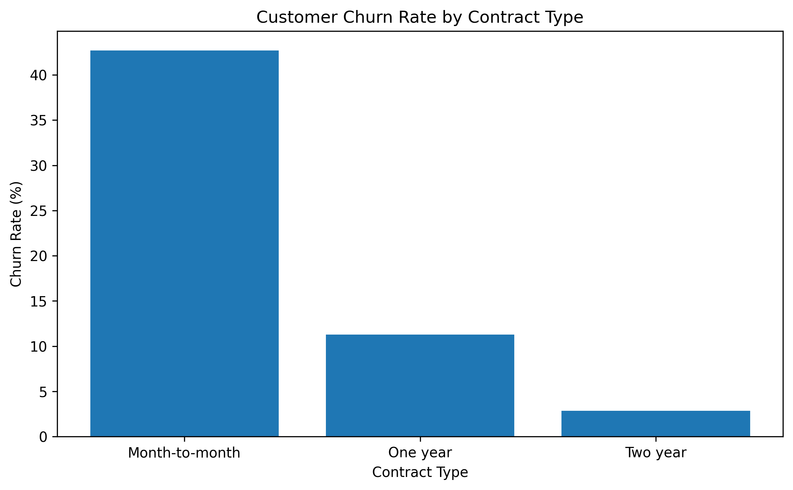
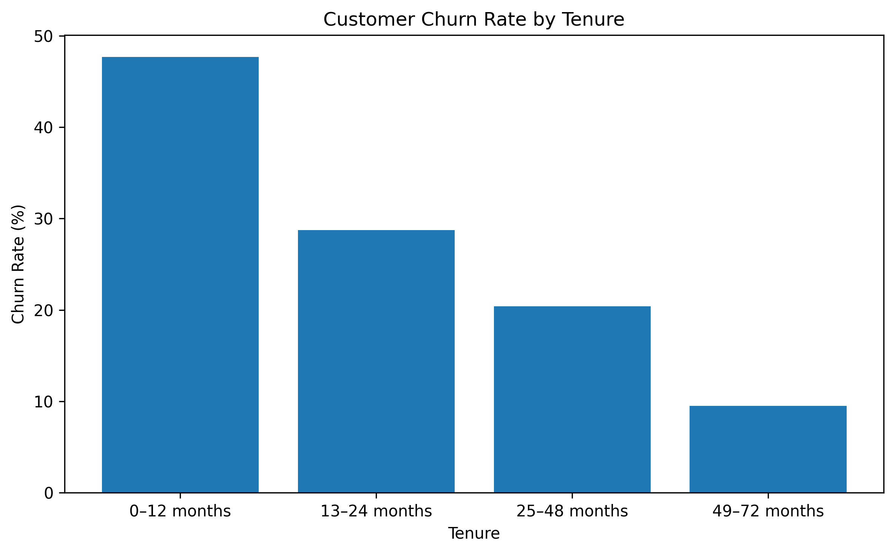
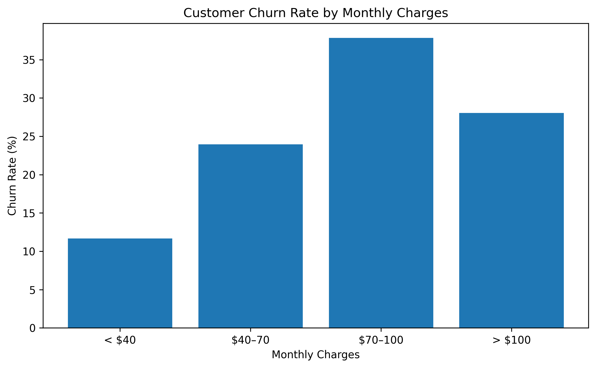
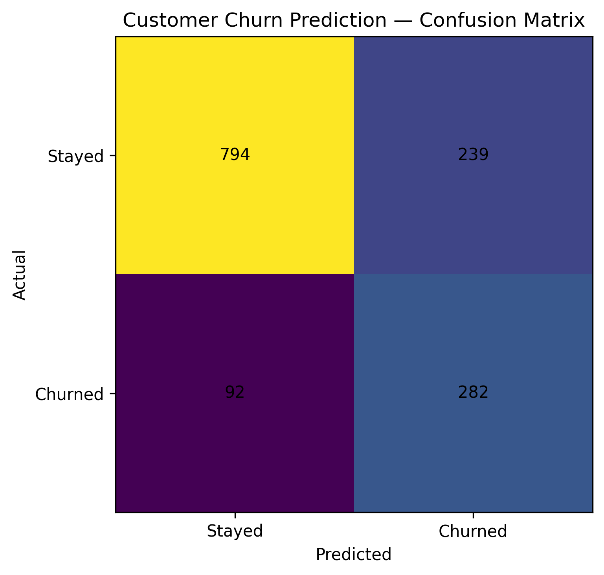
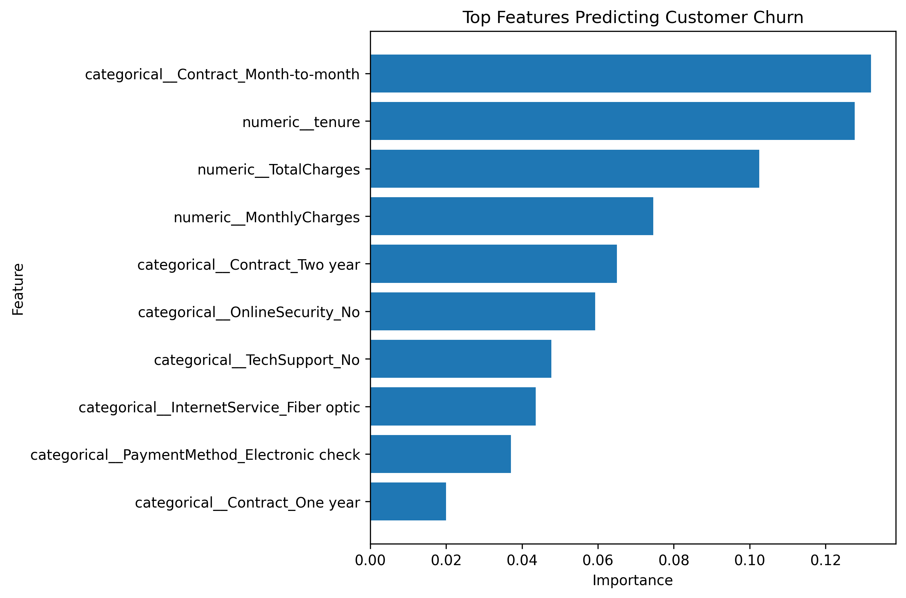

# Customer Churn Prediction & Retention Analytics

## Overview

This project develops a machine learning system to identify customers at risk of churn using the IBM Telco Customer Churn dataset.

Rather than focusing only on prediction accuracy, the project examines the characteristics associated with customer churn and translates the model results into actionable retention insights.

## Business Objective

Customer churn can significantly affect recurring revenue and customer lifetime value.

The objective is to:

* Identify customers who are likely to churn.
* Understand the strongest predictive factors associated with churn.
* Prioritize recall so that a large proportion of potential churners can be identified.
* Provide interpretable insights that can support customer retention strategies.

## Dataset

The project uses the IBM Telco Customer Churn dataset containing customer demographic, service, contract, billing, and account information.

After cleaning invalid `TotalCharges` values and removing duplicate customer records, the modeling dataset contains approximately 7,032 customers.

The target variable is:

* `0` — Stayed
* `1` — Churned

## Project Workflow

```text
Raw Data
   ↓
Data Cleaning
   ↓
Exploratory Data Analysis
   ↓
Feature Engineering
   ↓
Train/Test Split
   ↓
Preprocessing
   ↓
Baseline Model
   ↓
Random Forest
   ↓
Model Evaluation
   ↓
Feature Importance
   ↓
Business Insights
```

## Exploratory Analysis

The analysis focuses on three business dimensions:

### Contract Type

Month-to-month customers show substantially different churn behavior compared with customers on longer-term contracts.



### Customer Tenure

Churn patterns vary considerably according to how long customers have remained with the company.



### Monthly Charges

Customers with different monthly charge levels exhibit different churn rates.



## Machine Learning

A Random Forest classifier was selected because it can model nonlinear relationships between customer characteristics while providing feature importance for interpretation.

The preprocessing pipeline includes:

* Median imputation for numerical variables.
* Most-frequent imputation for categorical variables.
* One-hot encoding of categorical variables.
* Standardization of numerical variables.
* Class balancing in the Random Forest classifier.

A stratified 80/20 train-test split was used.

## Model Performance

### Random Forest

| Metric    |      Score |
| --------- | ---------: |
| Accuracy  | **76.47%** |
| Precision | **54.13%** |
| Recall    | **75.40%** |
| F1-score  | **63.02%** |

The model identified **282 of 374 churned customers**, corresponding to a churn recall of approximately 75%.



Because missing a potential churner can be costly for a retention team, recall and F1-score are emphasized rather than accuracy alone.

## Feature Importance

The strongest predictive features were:

| Feature                  | Importance |
| ------------------------ | ---------: |
| Month-to-month contract  |     13.19% |
| Tenure                   |     12.77% |
| Total charges            |     10.25% |
| Monthly charges          |      7.46% |
| Two-year contract        |      6.50% |
| No online security       |      5.93% |
| No technical support     |      4.78% |
| Fiber optic internet     |      4.36% |
| Electronic check payment |      3.71% |



These values indicate predictive importance rather than causal effects.

The results suggest that contract commitment, tenure, billing characteristics, and service configuration are among the strongest signals associated with churn risk.

## Business Insights

The model supports several retention-oriented observations:

* Customers on **month-to-month contracts** represent an important high-risk segment.
* **Shorter-tenure customers** require particular attention.
* **Monthly and total charges** are strong predictive signals.
* Customers without **online security or technical support** show meaningful predictive associations with churn.
* Payment method and internet service configuration also contribute to model predictions.

A potential retention strategy could therefore prioritize high-risk customers based on predicted churn probability while considering their tenure, contract type, charges, and service configuration.

## Limitations

* The dataset represents a specific telecommunications customer population and may not generalize to every market.
* Feature importance describes predictive association and should not be interpreted as causation.
* The dataset is historical and does not include actual retention interventions or their outcomes.
* Model performance may change when applied to new customer populations.

## Technologies

* Python
* Pandas
* NumPy
* Matplotlib
* Scikit-learn
* Joblib
* Jupyter Notebook

## Project Structure

```text
customer-churn-prediction/
│
├── data/
│   ├── raw/
│   └── processed/
│
├── figures/
│   ├── churn_by_contract.png
│   ├── churn_by_tenure.png
│   ├── churn_by_monthly_charges.png
│   ├── confusion_matrix.png
│   └── feature_importance.png
│
├── models/
│   └── customer_churn_random_forest.joblib
│
├── notebooks/
│   └── Customer_Churn_Prediction_Final.ipynb
│
├── .gitignore
├── README.md
└── requirements.txt
```

## Reproducibility

Install the required dependencies:

```bash
pip install -r requirements.txt
```

Then open:

```text
notebooks/Customer_Churn_Prediction_Final.ipynb
```

and run the notebook from beginning to end.

## Author

Manar Khadouma
